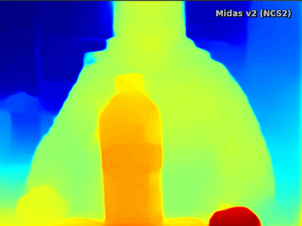

# Monodepth Midas v2.1
Monocular depth estimation using Midas v2.1 model running on Openvino (including NCS2) and DepthAI (OpenCV AI Kit, ...)
  


## Openvino version
Documentation [here](Openvino/readme.md)

## DepthAI version
Documentation [here]()

## Credits

#### Midas model:  
  
```
@article{Ranftl2020,
	author    = {Ren\'{e} Ranftl and Katrin Lasinger and David Hafner and Konrad Schindler and Vladlen Koltun},
	title     = {Towards Robust Monocular Depth Estimation: Mixing Datasets for Zero-shot Cross-dataset Transfer},
	journal   = {IEEE Transactions on Pattern Analysis and Machine Intelligence (TPAMI)},
	year      = {2020},
} 
```
#### Model convertion:
Thanks to Katsuya Hyodo: [https://github.com/PINTO0309](https://github.com/PINTO0309).


## Licence

MIT Licence
